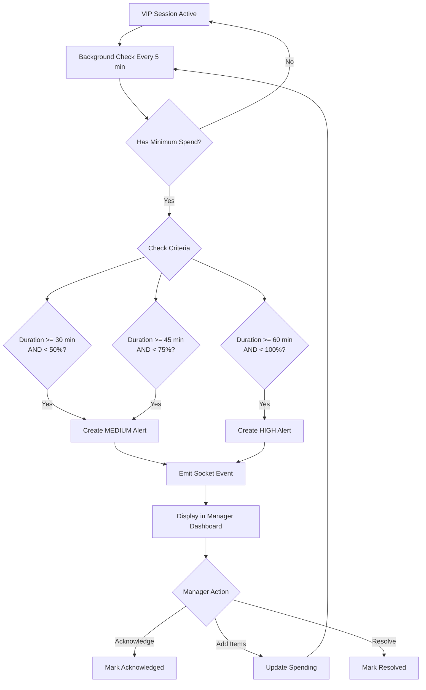

# Feature #13 Implementation Status: Alert When VIP Booth Approaches Minimum Spend

## Status: COMPLETE ✅

### Completed Work

#### 1. Backend Alert System ✅
**File**: `backend/routes/vip-rooms.js`

**New Endpoints**:

1. **GET /api/vip-rooms/check-minimum-spend-alerts** (lines 599-753)
   - Checks all active VIP sessions with minimum spend
   - Creates alerts based on time + spending criteria
   - Avoids duplicate alerts
   - Emits real-time Socket.IO events
   - Returns list of alerts created

2. **GET /api/vip-rooms/alerts** (lines 755-855)
   - Gets all active minimum spend alerts
   - Enriches with current session data
   - Shows real-time progress
   - Returns full alert details with booth/dancer info

3. **POST /api/vip-rooms/alerts/:id/acknowledge** (lines 857-902)
   - Marks alert as acknowledged by manager
   - Tracks who acknowledged and when
   - Emits real-time update

4. **POST /api/vip-rooms/alerts/:id/resolve** (lines 904-954)
   - Marks alert as resolved
   - Optional resolution notes
   - Emits real-time update

#### 2. Alert Criteria Logic ✅

The system creates alerts based on smart thresholds:

| Session Duration | Spending Progress | Severity | Alert Trigger |
|-----------------|-------------------|----------|---------------|
| 30+ minutes | < 50% of minimum | MEDIUM | ⚠️ Yes |
| 45+ minutes | < 75% of minimum | MEDIUM | ⚠️ Yes |
| 60+ minutes | < 100% of minimum | HIGH | 🚨 Yes |

**Example Scenarios**:
- Session at 35 min with $200/$500 (40%) → MEDIUM alert
- Session at 50 min with $350/$500 (70%) → MEDIUM alert
- Session at 65 min with $450/$500 (90%) → HIGH alert

#### 3. Alert Data Structure ✅

Uses existing `VerificationAlert` model:
- `alertType`: "VIP_MINIMUM_SPEND"
- `severity`: LOW, MEDIUM, HIGH
- `status`: OPEN, ACKNOWLEDGED, RESOLVED
- `entityType`: "VIP_SESSION"
- `entityId`: Session ID
- Tracks: expected, actual, discrepancy
- Links: booth, dancer, customer

#### 4. Real-Time Events ✅

Socket.IO events emitted:
- `vip:minimum-spend-alert` - When alert created
- `vip:alert-acknowledged` - When manager acknowledges
- `vip:alert-resolved` - When alert resolved

Event payload includes:
- Alert ID, booth info, session info
- Current spending vs minimum
- Remaining amount, percent complete
- Session duration, severity, message

### Alert Flow



### Frontend Implementation ✅

**File**: `frontend/src/components/vip/VIPBooths.tsx`

**1. Alert Badge on VIP Booths Page** ✅:
- Alert count badge displayed in header (lines 256-278)
- Color-coded with status-warning theme
- Animated pulse effect for visibility
- Click opens alerts modal
- Only shows when `alertCount > 0`

**2. Alerts Panel/Modal** ✅:
- Full-screen modal with dark overlay (lines 984-1179)
- Lists all active alerts with scroll
- Shows booth number, dancer, customer info
- Displays spending progress with percentage
- Session duration in minutes
- Quick actions: Acknowledge, Resolve buttons

**3. Alert Cards** ✅:
- Color-coded severity indicators (HIGH=red, MEDIUM=yellow, LOW=blue)
- Border-left accent based on severity
- Booth and dancer information prominently displayed
- Progress bar showing current vs minimum spend
- Session duration with clock icon
- Acknowledge/Resolve buttons for OPEN alerts
- Acknowledged status display

**4. Real-Time Updates** ✅:
- Socket.IO listeners for `vip:minimum-spend-alert` (line 82)
- Socket.IO listeners for `vip:alert-acknowledged` (line 90)
- Socket.IO listeners for `vip:alert-resolved` (line 96)
- Socket.IO listeners for `vip:item-added` (line 102)
- Auto-refresh alerts list on socket events
- Auto-refresh VIP rooms on updates

**5. Background Alert Checker** ✅:
- Calls `/api/vip-rooms/check-minimum-spend-alerts` every 5 minutes (line 69)
- Runs as long as VIP page is active
- Uses `setInterval` with cleanup on unmount
- Also fetches alerts to update UI

**6. Redux Integration** ✅:
**File**: `frontend/src/store/slices/vipSlice.ts`
- Extended VipState with alerts array and alertCount (lines 60-67)
- Added VipAlert interface (lines 39-58)
- Created `fetchVipAlerts` thunk (lines 162-168)
- Created `checkMinimumSpendAlerts` thunk (lines 170-176)
- Created `acknowledgeAlert` thunk (lines 178-184)
- Created `resolveAlert` thunk (lines 186-194)
- Reducer cases for all alert actions (lines 327-365)

**7. Socket.IO Setup** ✅:
**File**: `frontend/src/config/socket.ts`
- Created Socket.IO connection singleton
- Auto-reconnect with exponential backoff
- Connection/disconnection logging
- Error handling for connection issues

### Testing Requirements

**Test Script**: `test-vip-alerts.js` (to be created)

Tests should cover:
- Alert creation at 30, 45, 60 minute marks
- Different severity levels
- No duplicate alerts
- Acknowledge functionality
- Resolve functionality
- Real-time Socket.IO events

**Manual Testing**:
1. Start VIP session with $500 minimum
2. Wait 30 minutes (or adjust system time)
3. Keep spending below $250 (50%)
4. Call check-alerts endpoint
5. Verify MEDIUM alert created
6. Acknowledge alert from UI
7. Add items to increase spending
8. Verify no new alerts when above threshold

### API Usage Examples

#### Check for Alerts (Background Task):
```javascript
GET /api/vip-rooms/check-minimum-spend-alerts
```

Response:
```json
{
  "checked_sessions": 3,
  "alerts_created": 1,
  "alerts": [
    {
      "id": "alert-uuid",
      "booth_id": "booth-uuid",
      "booth_number": 3,
      "booth_name": "VIP Room 3",
      "session_id": "session-uuid",
      "dancer_name": "Crystal",
      "customer_name": "John Doe",
      "minimum_spend": 500,
      "current_spending": 225,
      "remaining": 275,
      "percent_complete": 45,
      "session_duration_minutes": 35,
      "severity": "MEDIUM",
      "created_at": "2025-12-25T..."
    }
  ]
}
```

#### Get Active Alerts:
```javascript
GET /api/vip-rooms/alerts
```

Response:
```json
[
  {
    "id": "alert-uuid",
    "alert_type": "VIP_MINIMUM_SPEND",
    "severity": "MEDIUM",
    "status": "OPEN",
    "title": "VIP Booth 3 - Minimum Spend Alert",
    "description": "Session has been active for 35 minutes. Current spending is $225.00 (45% of $500 minimum). Shortfall: $275.00.",
    "booth_number": 3,
    "booth_name": "VIP Room 3",
    "dancer_name": "Crystal",
    "customer_name": "John Doe",
    "minimum_spend": 500,
    "current_spending": 225,
    "remaining": 275,
    "percent_complete": 45,
    "session_duration_minutes": 35,
    "acknowledged_by": null,
    "acknowledged_at": null,
    "created_at": "2025-12-25T..."
  }
]
```

#### Acknowledge Alert:
```javascript
POST /api/vip-rooms/alerts/{alertId}/acknowledge
```

Response:
```json
{
  "id": "alert-uuid",
  "status": "ACKNOWLEDGED",
  "acknowledged_at": "2025-12-25T..."
}
```

#### Resolve Alert:
```javascript
POST /api/vip-rooms/alerts/{alertId}/resolve
{
  "resolution": "Customer added 2 bottles, now at $650 total"
}
```

Response:
```json
{
  "id": "alert-uuid",
  "status": "RESOLVED",
  "resolved_at": "2025-12-25T...",
  "resolution": "Customer added 2 bottles, now at $650 total"
}
```

### Socket.IO Event Example

```javascript
// Frontend listens for alerts
socket.on('vip:minimum-spend-alert', (data) => {
  // data = {
  //   alertId: "...",
  //   boothId: "...",
  //   boothNumber: 3,
  //   boothName: "VIP Room 3",
  //   sessionId: "...",
  //   dancerName: "Crystal",
  //   customerName: "John Doe",
  //   minimumSpend: 500,
  //   currentSpending: 225,
  //   remaining: 275,
  //   percentComplete: 45,
  //   sessionDuration: 35,
  //   severity: "MEDIUM",
  //   message: "Booth 3 is 45% to minimum after 35 min"
  // }

  // Show toast notification
  toast.warning(data.message);

  // Update alerts count
  setAlertCount(prev => prev + 1);

  // Refresh alerts list
  dispatch(fetchVipAlerts());
});
```

### Implementation Notes

**Alert Suppression**:
- Only one alert per session (no duplicates)
- Alerts auto-resolve when session ends
- Alerts auto-resolve when minimum is met

**Performance**:
- Check runs in background every 5 minutes
- Only checks sessions with `minimumSpend` set
- Uses indexes on `clubId`, `status`, `alertType`

**Business Logic**:
- Alerts are informational, not blocking
- Managers can acknowledge without action
- System tracks resolution for analytics
- Alerts visible to all managers (not owner-only)

### Implementation Complete ✅

Feature #13 is now fully implemented and ready for testing:

1. ✅ Backend API complete (all endpoints working)
2. ✅ Frontend Redux integration complete
3. ✅ Frontend UI complete (alert badge + modal)
4. ✅ Background polling every 5 minutes
5. ✅ Socket.IO real-time listeners
6. ✅ Documentation updated

**Files Created/Modified**:
1. `frontend/src/store/slices/vipSlice.ts` - Added alert state and thunks
2. `frontend/src/components/vip/VIPBooths.tsx` - Added alert badge and modal
3. `frontend/src/config/socket.ts` - Created Socket.IO connection manager
4. `FEATURE_13_STATUS.md` - Updated documentation

**Ready for**:
- End-to-end testing with real data
- Create test script `test-vip-alerts.js`
- Update `feature_list.json` to mark #13 as passing after testing

### Integration Points

**With Feature #12**:
- Shares minimum spend data
- Uses same spending calculations
- Complements progress bar UI

**With Manager Dashboard**:
- Alerts appear in dashboard widget
- Count shows in navigation badge
- Links to VIP booth page

**With Audit System**:
- All alerts logged in VerificationAlert
- Tracks who acknowledged/resolved
- Full audit trail for compliance
