# ClubOps Operations Manual
## Complete User Guide with Visual Walkthrough

**Version 2.0 - With Screenshots**
**Last Updated:** December 18, 2025
**Application Version:** 3.0.5

---

# 📖 Table of Contents

- [Part 1: Getting Started](#part-1-getting-started)
  - [System Requirements](#system-requirements)
  - [Accessing ClubOps](#accessing-clubops)
  - [User Roles & Permissions](#user-roles--permissions)
- [Part 2: Core Features](#part-2-core-features)
  - [Dashboard Overview](#dashboard-overview)
  - [Dancer Management](#dancer-management)
  - [DJ Queue System](#dj-queue-system)
  - [VIP Booth Tracking](#vip-booth-tracking)
  - [Revenue Dashboard](#revenue-dashboard)
- [Part 3: Settings & Configuration](#part-3-settings--configuration)
- [Part 4: Subscription Management](#part-4-subscription-management)
- [Part 5: Mobile Access](#part-5-mobile-access)
- [Part 6: Troubleshooting](#part-6-troubleshooting)
- [Appendix: Quick Reference](#appendix-quick-reference)

---

# Welcome to ClubOps

ClubOps is a **premium, all-in-one club management SaaS platform** designed specifically for gentlemen's clubs. Our system streamlines operations, ensures compliance, and provides real-time insights to maximize your revenue.

## What ClubOps Does for You

✅ **Automated Compliance Tracking** - Never worry about expired licenses again
✅ **Real-Time Operations** - WebSocket-powered live updates across all devices
✅ **Revenue Intelligence** - Comprehensive financial analytics and reporting
✅ **Multi-Device Access** - Full desktop and mobile responsive design
✅ **Fraud Prevention** - Built-in verification and audit logging
✅ **Role-Based Access** - Secure permissions for owners, managers, DJs, and staff

---

# Part 1: Getting Started

## System Requirements

### Supported Browsers
- ✅ Google Chrome (Recommended) - Version 90+
- ✅ Mozilla Firefox - Version 88+
- ✅ Safari - Version 14+
- ✅ Microsoft Edge - Version 90+

### Device Requirements
- **Desktop/Laptop:** 1920x1080 or higher resolution
- **Tablet:** iPad (6th gen or later), Android tablets with 10" screens
- **Mobile:** iPhone (X or later), Android phones (2020+)
- **Internet:** Minimum 5 Mbps connection (10+ Mbps recommended)

### Hardware Recommendations
- **Processor:** Intel i5 or equivalent (for optimal performance)
- **RAM:** 4GB minimum, 8GB recommended
- **Storage:** Modern SSD for faster load times

---

## Accessing ClubOps

### Production URLs

| Service | URL |
|---------|-----|
| **Frontend Application** | https://clubops-saas-frontend.vercel.app |
| **Backend API** | https://clubops-backend.vercel.app |
| **Status** | ✅ Live & Operational |

### Test Credentials (Demo)

```
Email: admin@clubops.com
Password: password
```

**⚠️ Security Note:** Change default credentials immediately in production environments.

---

## Chapter 1: Your First Login

### Authentication Portal

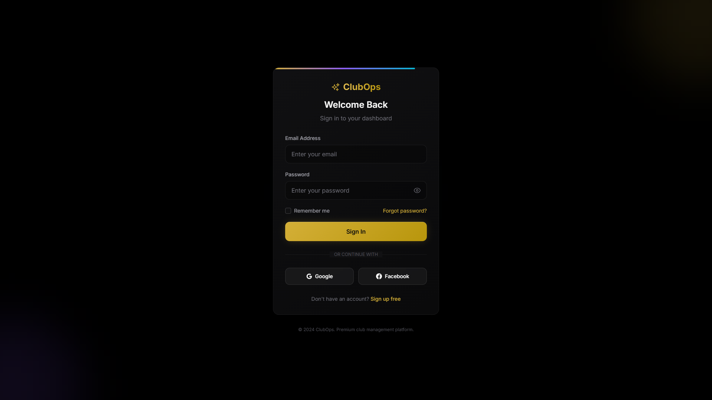
*Professional login interface with social authentication options*

### Login Steps

1. **Navigate** to your ClubOps URL
2. **Enter** your email address
3. **Enter** your password
4. **Click** the gold "Sign In" button

### First-Time Login

If this is your first time accessing ClubOps:

1. Check your email for a **welcome message** from support@clubops.com
2. Click the **"Set Your Password"** link
3. Create a strong password (minimum 8 characters, mix of letters/numbers/symbols)
4. **Save your credentials** in a password manager
5. Return to login page and sign in

### Forgot Password

1. Click **"Forgot Password?"** link on login page
2. Enter your email address
3. Check inbox for password reset link
4. Click link and set new password
5. Log in with new credentials

---

# Part 2: Core Features

## Chapter 2: Dashboard Overview

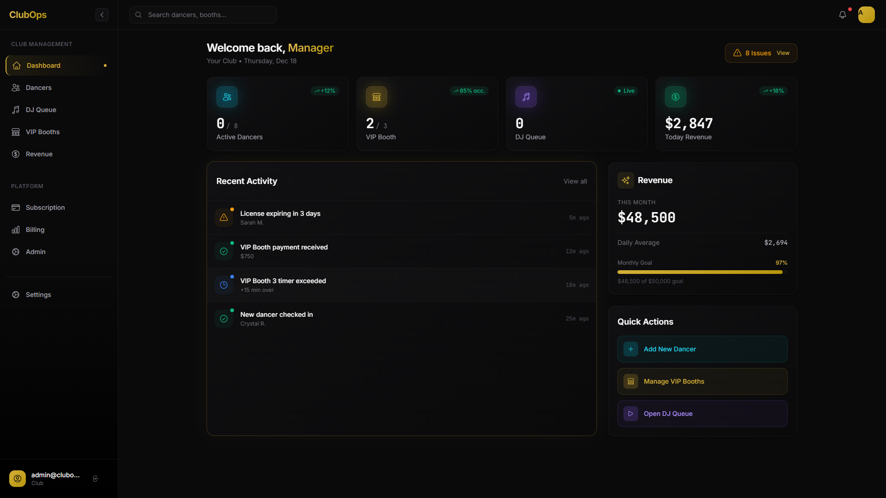
*Real-time command center with metrics, activity feed, and quick actions*

### Dashboard Layout

The dashboard is organized into **four key sections**:

#### 1. Metrics Cards (Top Row)

| Metric | Description | Updates |
|--------|-------------|---------|
| **Active Dancers** | Currently checked in | Real-time |
| **VIP Booths** | Occupied vs. Available | Real-time |
| **Today's Revenue** | Bar fees + VIP income | Live calculation |
| **Compliance Alerts** | Licenses expiring/expired | Daily |

#### 2. Activity Feed (Center)

Shows recent system events in chronological order:
- ✅ Dancer check-ins/check-outs
- 🎵 DJ queue updates
- 🏠 VIP booth sessions started/ended
- 💰 Revenue transactions

**Features:**
- Real-time WebSocket updates (no page refresh needed)
- Timestamped entries
- User attribution (who performed the action)
- Filterable by event type

#### 3. Quick Actions Panel (Right Sidebar)

One-click access to common tasks:
- **+ Add Dancer** - Open onboarding form
- **View Queue** - Jump to DJ interface
- **Financial Report** - Generate revenue summary
- **Settings** - Access configuration

#### 4. Navigation Menu (Left Sidebar)

```
📊 CLUB MANAGEMENT
├── Dashboard (Home)
├── Dancers (Roster & Compliance)
├── DJ Queue (Stage Management)
├── VIP Booths (Session Tracking)
└── Revenue (Financial Analytics)

⚙️ PLATFORM
├── Subscription (Plan & Billing)
├── Billing (Payment Methods)
└── Admin (System Configuration)

🔧 SETTINGS
└── Profile, Club Info, Preferences
```

### Interpreting Metrics

**Active Dancers Count:**
- Shows dancers currently checked in
- Color-coded: Green (normal), Yellow (nearing capacity), Red (at capacity)

**VIP Booth Status:**
- Format: "X/Y Active" where X = occupied, Y = total booths
- Click to view detailed booth breakdown

**Today's Revenue:**
- Real-time calculation from all sources
- Includes: Bar fees (paid + deferred), VIP booth sessions, cover charges
- Refreshes every 30 seconds

**Compliance Alerts:**
- 🔴 **Red Badge** = Expired licenses (action required)
- 🟡 **Yellow Badge** = Licenses expiring within 14 days (warning)
- 🟢 **Green** = All compliant (no badge)

---

## Chapter 3: Dancer Management

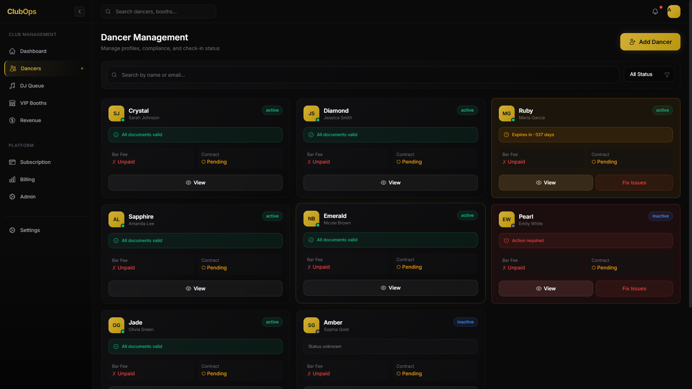
*Comprehensive dancer profiles with compliance tracking and search*

### Dancer Roster Overview

The dancer management screen provides a **bird's-eye view** of your entire roster with:
- Search and filter capabilities
- Compliance status at-a-glance
- Quick action buttons
- Summary statistics

### Key Features

#### 1. Search & Filter Bar

**Search by:**
- Stage name
- Legal name
- Email address
- Phone number

**Filter by:**
- Status: Active | Inactive | On Break
- Compliance: Valid | Expiring Soon | Expired
- Bar Fee: Paid | Unpaid | Deferred

#### 2. Dancer Cards

Each card displays:

```
┌─────────────────────────────────────┐
│ 💃 [Avatar] STAGE NAME              │
│    Legal Name                        │
│                                      │
│ 🪪 License: [✓ Valid | ⚠ Expires | ✗ Expired] │
│ 💵 Bar Fee: [✓ Paid | ✗ Unpaid]    │
│ 📄 Contract: [✓ Signed | ○ Pending]│
│                                      │
│ [👁 View]  [⚠ Fix Issues]           │
└─────────────────────────────────────┘
```

**Status Indicators:**
- ✓ Green Checkmark = Compliant/Paid
- ⚠ Yellow Warning = Action needed soon
- ✗ Red X = Immediate action required
- ○ Gray Circle = Pending/Not applicable

#### 3. Compliance Status Colors

| Status | Color | Badge | Action |
|--------|-------|-------|--------|
| **All Valid** | Green border | ✓ All documents valid | None required |
| **Expiring Soon** | Yellow border | ⚠ Expires in X days | Send reminder |
| **Expired** | Red border | ✗ Action required | Update immediately |

#### 4. Summary Statistics (Bottom)

Four metric cards showing:
1. **Active Now** (Green) - Dancers currently checked in
2. **Expiring Soon** (Yellow) - Licenses expiring within 30 days
3. **Non-Compliant** (Red) - Expired licenses or missing documents
4. **Total Dancers** (Blue) - Complete roster count

### Adding a New Dancer

**Method 1: Manual Entry (Recommended)**

1. Click **"+ Add Dancer"** button (top right)
2. Fill out the dancer information form:
   - Legal Name (required)
   - Stage Name (optional but recommended)
   - Email Address
   - Phone Number
   - License Information
   - Photo (optional)
3. Click **"Add Dancer"** to save

**Method 2: Application Link (Self-Service)**

1. Click **"+ Add Dancer"** → **"Send Application Link"**
2. Enter dancer's email address
3. Click **"Send Invitation"**
4. Dancer receives email with secure application link
5. They complete the application remotely
6. Review and approve from **"Pending Applications"** tab

### Viewing Dancer Details

Click **"View"** button on any dancer card to see:

**Personal Information:**
- Legal name & stage name
- Contact details (email, phone)
- Date of birth
- Emergency contact

**Compliance Documents:**
- License number & expiration date
- State of issuance
- Scanned ID/license image
- Contract signature & date

**Performance History:**
- Total shifts worked
- Average shift length
- Bar fee payment record
- VIP booth sessions

**Financial Summary:**
- Total bar fees paid
- Outstanding deferred payments
- VIP revenue generated
- Payment history timeline

### Handling Compliance Issues

**Scenario 1: License Expiring Soon (Yellow)**

1. Click the dancer card with yellow border
2. Review expiration date
3. Click **"Send Reminder"** button
4. Email sent to dancer with renewal instructions
5. Follow up 7 days before expiration

**Scenario 2: License Expired (Red)**

1. Dancer card shows red border with "✗ Action required"
2. **Automatic System Block:** Cannot check in until resolved
3. Click **"Fix Issues"** button
4. Options:
   - **Upload New License:** If dancer has renewed
   - **Mark as Inactive:** If dancer is on leave
   - **Send Urgent Notice:** Email with deadline

**Manual License Update:**
1. Click **"View"** → **"Edit License Info"**
2. Enter new license number
3. Upload scanned license image
4. Set new expiration date
5. Click **"Save Changes"**
6. System automatically updates compliance status

### Dancer Check-In/Check-Out Workflow

**Checking In a Dancer:**

1. Go to **Dashboard** or **Dancers** page
2. Search for dancer by name
3. System displays license status:
   - 🟢 **Green** = Good to check in
   - 🟡 **Yellow** = Warn about expiration
   - 🔴 **Red** = BLOCKED (cannot proceed)
4. If green/yellow, click **"Check In"**
5. System prompts for bar fee payment:
   - **Paid Now** (default)
   - **Defer Payment** (tracked automatically)
6. Click **"Confirm Check-In"**

**Checking Out a Dancer:**

1. Go to **"Currently Checked In"** tab
2. Find the dancer
3. Click **"Check Out"**
4. If deferred payment exists:
   - System prompts to collect bar fee
   - Options: **Collect Now** | **Keep Deferred** | **Waive (Manager Only)**
5. Click **"Confirm Check-Out"**

---

## Chapter 4: DJ Queue System

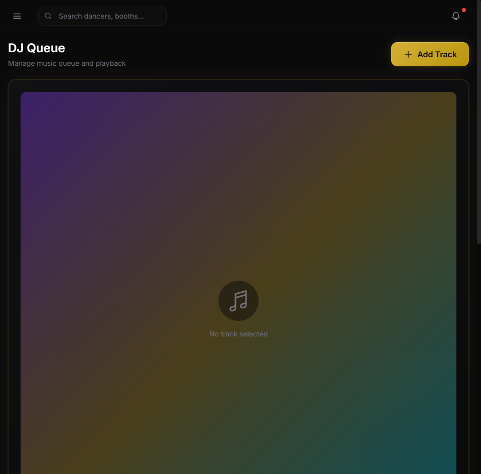
*Drag-and-drop stage management with real-time timers and music player*

### DJ Interface Overview

The DJ Queue is designed for **fast, fluid stage rotation management** with three main panels:

#### Left Panel: Available Dancers
- Shows all checked-in dancers not currently in queue
- Alphabetically sorted
- Search/filter capabilities
- Drag-and-drop source

#### Center Panel: Stage Queues
- One column per stage (if multi-stage club)
- Drag-and-drop reordering
- Position numbers auto-update
- Next-up dancer highlighted

#### Right Panel: Now Performing
- Current dancer on each stage
- Countdown timer (or stopwatch)
- Performance duration tracking
- End performance button

### Managing the Queue

**Adding Dancers to Queue:**

**Method 1: Drag and Drop**
1. Click and hold dancer card in "Available Dancers"
2. Drag to desired position in stage queue
3. Release to drop
4. Queue automatically renumbers

**Method 2: Quick Add**
1. Click **"+"** button at bottom of queue
2. Select dancer from dropdown
3. Dancer added to end of queue

**Rearranging Queue Order:**
1. Click and hold any dancer in queue
2. Drag up or down to new position
3. Release to confirm
4. Changes sync across all devices instantly (WebSocket)

**Removing from Queue:**
1. Hover over dancer in queue
2. Click **"X"** icon (top right of card)
3. Dancer returns to "Available Dancers" pool

### Starting a Performance

**Automatic Flow:**
1. Dancer at top of queue is highlighted as "Next Up"
2. Click **"Send to Stage"** button
3. Dancer moves to "Now Performing" panel
4. Timer starts automatically
5. Next dancer moves to top of queue

**Manual Timer Control:**
- **Pause/Resume:** Click timer to pause/resume
- **Add Time:** Click **"+1 min"** to extend performance
- **End Performance:** Click **"End"** button
  - Dancer removed from stage
  - Duration logged to system
  - Next dancer ready to go

### Music Player Integration

**Player Controls (Bottom Bar):**
- ▶ Play / ⏸ Pause
- ⏮ Previous Track
- ⏭ Next Track
- 🔊 Volume Slider
- 🔀 Shuffle Toggle
- 🔁 Repeat Mode

**Song Queue:**
- View upcoming songs
- Drag to reorder playlist
- Remove songs with **"X"** icon
- Search library to add songs

**Dancer Playlists:**
- Each dancer can have preferred songs
- Auto-load when dancer goes to stage
- Override with custom selection if needed

### Multi-Stage Management

**For clubs with multiple stages:**

1. Each stage has its own queue column
2. Drag dancers between stage queues
3. Each stage's timer runs independently
4. Color-coded stage names (customizable)

**Stage Status Indicators:**
- **Green** = Available (no dancer performing)
- **Blue** = Dancer performing
- **Red** = Performance time exceeded

---

## Chapter 5: VIP Booth Tracking

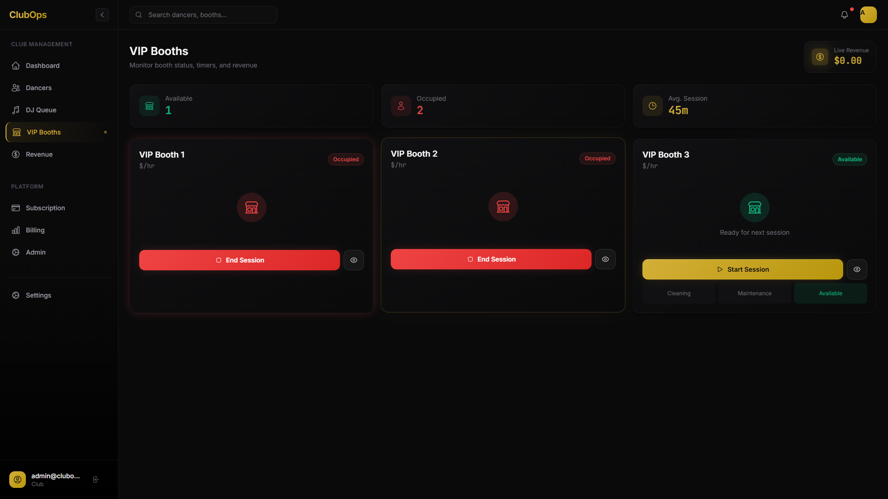
*Real-time booth occupancy with session timers and revenue tracking*

### VIP Booth Overview

Track all VIP booth sessions with precision timing and automatic revenue calculation.

### Booth Status Grid

**Visual Layout:**
```
┌──────────┬──────────┬──────────┬──────────┐
│ Booth 1  │ Booth 2  │ Booth 3  │ Booth 4  │
│ Available│ Occupied │ Available│ Occupied │
│ (Green)  │ (Red)    │ (Green)  │ (Red)    │
│          │ 🕐 12:34 │          │ 🕐 45:12 │
│          │ Dancer A │          │ Dancer B │
└──────────┴──────────┴──────────┴──────────┘
```

**Status Colors:**
- **Green** = Available for booking
- **Red** = Currently occupied
- **Yellow** = Reserved/pre-booked
- **Gray** = Closed/unavailable

### Starting a VIP Session

1. Click on a **green (available)** booth
2. Session start modal appears:
   - **Select Dancer** (dropdown of checked-in dancers)
   - **Session Duration** (15 min | 30 min | 1 hour | Custom)
   - **Rate** (auto-filled from settings, editable)
   - **Customer Name** (optional)
   - **Customer Phone** (optional)
   - **Payment Method** (Cash | Card | Deferred)
3. Click **"Start Session"**
4. Timer begins immediately
5. Session appears on all screens (real-time sync)

**Calculated Revenue:**
- System auto-calculates: `Duration × Song Rate`
- Example: 30 min session at $30/song (3.5 min songs) = 8.57 songs × $30 = $257
- Displayed in real-time on booth card

### Active Session Management

**During a Session:**

**Booth Card Shows:**
- Dancer name & avatar
- Countdown timer (HH:MM:SS)
- Revenue accumulating
- **Extend** button
- **End** button

**Extending a Session:**
1. Click **"Extend Time"** on active booth
2. Select additional time
3. Additional fee calculated automatically
4. Click **"Confirm Extension"**
5. Timer adds time, revenue updates

**Ending a Session:**
1. Click **"End Session"** button
2. Confirmation modal shows:
   - Session duration (actual)
   - Total songs (calculated)
   - Total revenue
   - Payment method
3. Click **"Confirm & End"**
4. Revenue logged to system
5. Booth returns to available status

### Session Timer Alerts

**Built-in Warnings:**

| Time Remaining | Alert | Action |
|----------------|-------|--------|
| 5 minutes | 🟡 Yellow warning | Notify dancer/customer |
| 1 minute | 🟠 Orange alert | Prepare to end session |
| Time's up | 🔴 Red alert + Audio | End session or extend |

**Audio Notifications:**
- Configurable in Settings
- Gentle chime (not disruptive to customers)
- Can be disabled per-booth

### VIP Revenue Dashboard

**Summary Panel (Top Right):**
- **Tonight's VIP Total:** Real-time calculation
- **Sessions Completed:** Count of ended sessions
- **Active Sessions:** Current occupied booths
- **Average Session:** Mean duration across all sessions

**Session History:**
- Scrollable list of all VIP sessions
- Filter by: Today | This Week | This Month | Custom Range
- Export to Excel/PDF

---

## Chapter 6: Revenue Dashboard

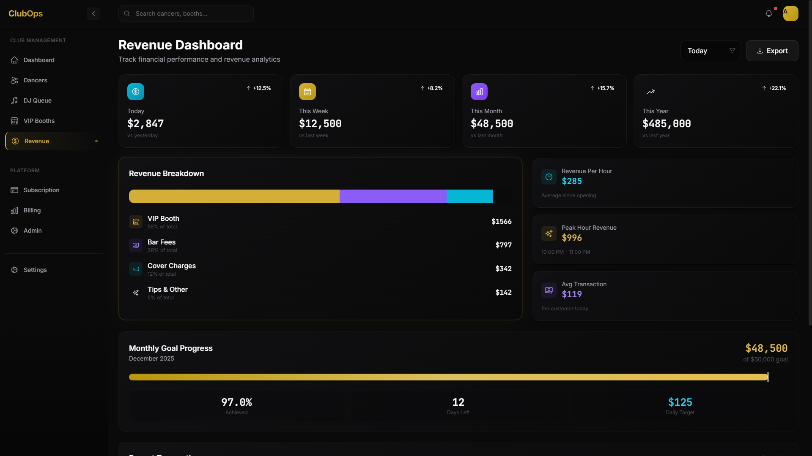
*Comprehensive financial tracking with charts, trends, and transaction history*

### Revenue Overview

The revenue dashboard provides **real-time financial intelligence** with multiple views:

#### 1. Revenue Summary Cards (Top Row)

| Card | Metric | Updates |
|------|--------|---------|
| **Today's Total** | All revenue sources combined | Live |
| **Bar Fees** | Collected + Deferred | Live |
| **VIP Revenue** | Booth session fees | Live |
| **Cover Charges** | Door/entry fees | Live |

#### 2. Revenue Chart (Center)

**Chart Types:**
- **Line Graph:** Daily revenue trends (7-day, 30-day, 90-day)
- **Bar Chart:** Revenue by source comparison
- **Pie Chart:** Revenue distribution breakdown

**Interactive Features:**
- Hover for exact values
- Click legend to toggle data series
- Zoom in/out on time ranges
- Download chart as image

#### 3. Recent Transactions (Bottom)

**Transaction Table Columns:**
- **Timestamp:** Date & time
- **Type:** Bar Fee | VIP Session | Cover | Other
- **Dancer:** Associated performer (if applicable)
- **Amount:** Dollar value
- **Payment Method:** Cash | Card | Deferred
- **Recorded By:** Staff member who logged it
- **Status:** Completed | Pending | Disputed

**Table Features:**
- Sort by any column
- Filter by transaction type
- Search by dancer or amount
- Export selected rows

### Running Reports

**Report Types:**

1. **Daily Summary**
   - Single day financial snapshot
   - Breakdown by revenue source
   - Comparison to previous day
   - Busiest hours analysis

2. **Weekly Report**
   - 7-day rolling window
   - Day-over-day comparison
   - Peak days identified
   - Trend analysis

3. **Monthly Report**
   - Full month breakdown
   - Week-over-week growth
   - Dancer performance rankings
   - Seasonal trends

4. **Custom Range**
   - Select any start/end date
   - Flexible for special events
   - Quarter/year-end reporting

**Generating a Report:**

1. Go to **Revenue** → **Reports**
2. Click **"Generate Report"** button
3. Select report type
4. Choose date range (if custom)
5. Click **"Generate"**
6. Report displays in ~2-3 seconds
7. Options:
   - **Export PDF:** Print-ready format
   - **Export Excel:** For further analysis
   - **Email Report:** Send to recipients
   - **Schedule:** Auto-generate weekly/monthly

### Understanding Financial Metrics

**Bar Fee Tracking:**
- **Collected:** Cash-in-hand from dancers
- **Deferred:** Fees to be paid later (tracked per dancer)
- **Outstanding:** Total deferred across all dancers
- **Collection Rate:** (Collected / Total) × 100%

**VIP Revenue Calculation:**
```
Session Revenue = (Duration in minutes / Avg Song Duration) × Song Rate
```

**Example:**
- 45-minute session
- 3.5 minute average song length
- $30 per song rate
- Calculation: (45 / 3.5) × $30 = **$385.71**

**Revenue Trends:**
- **Daily Average:** Total revenue / Days in period
- **Peak Day:** Highest revenue day
- **Growth Rate:** (This Period - Last Period) / Last Period
- **Forecast:** Projected revenue based on trends

---

# Part 3: Settings & Configuration

## Chapter 7: Settings

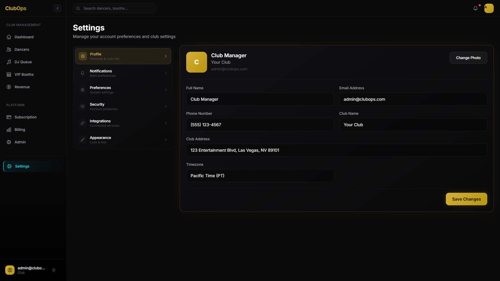
*Customize your ClubOps experience with club info, preferences, and team management*

### Settings Navigation

```
⚙️ SETTINGS
├── Profile (Your account details)
├── Club Information (Name, address, logo)
├── Operations (Bar fees, rates, hours)
├── Team Members (Staff management)
├── VIP Booth Setup (Booths & pricing)
├── Notifications (Email & alerts)
└── Security (Password, 2FA, sessions)
```

### Profile Settings

**Personal Information:**
- Name (First, Last)
- Email address
- Phone number
- Profile photo

**Password Management:**
- Current password required
- New password (8+ characters, mixed case, numbers, symbols)
- Confirm new password
- **Change Password** button

**Two-Factor Authentication (2FA):**
- Enable/Disable toggle
- Setup via QR code (Google Authenticator, Authy)
- Backup codes (download and store securely)

### Club Information

**Basic Details:**
- Club name
- Address (street, city, state, ZIP)
- Phone number
- Email address
- Website URL

**Branding:**
- **Upload Logo:** Drag-and-drop or click to browse
  - Recommended size: 512×512px
  - Formats: PNG, JPG, SVG
  - Max file size: 2MB
- **Color Theme:** Primary/secondary brand colors
- **Tagline:** Displayed on dashboards

### Operations Configuration

**Bar Fee Settings:**
- Default bar fee amount
- Waiver requires manager approval (toggle)
- Deferral period limit (days)
- Auto-reminder for deferred payments

**VIP Booth Settings:**
- Default song rate ($/song)
- Average song duration (seconds)
- Session time presets (15, 30, 60 minutes)
- Overtime alert timing

**Business Hours:**
- Opening time
- Closing time
- Days of operation
- Holiday schedule

### Team Member Management

**Current Team:**
- List of all staff members
- Role badges (Owner, Manager, DJ, Door Staff)
- Last login timestamp
- **Edit** | **Remove** actions

**Adding a Team Member:**
1. Click **"+ Add Team Member"**
2. Enter name and email
3. Select role from dropdown:
   - **Owner:** Full access to everything
   - **Manager:** Operations + financials, no system config
   - **DJ:** Queue management only
   - **Door Staff:** Check-in/check-out only
4. Click **"Send Invitation"**
5. User receives email to set password
6. They appear in team list after signup

**Role Permissions:**

| Feature | Owner | Manager | DJ | Door Staff |
|---------|-------|---------|----|-----------|
| Dashboard | ✓ | ✓ | ✓ | ✓ |
| Dancers (View) | ✓ | ✓ | ✓ | ✓ |
| Dancers (Edit) | ✓ | ✓ | ✗ | ✗ |
| DJ Queue | ✓ | ✓ | ✓ | ✗ |
| VIP Booths | ✓ | ✓ | View | ✗ |
| Revenue | ✓ | ✓ | ✗ | ✗ |
| Settings | ✓ | Partial | ✗ | ✗ |
| Subscription | ✓ | ✗ | ✗ | ✗ |

### Notification Preferences

**Email Notifications:**
- [ ] Dancer check-in/out
- [x] License expiring (7 days before)
- [x] License expired
- [x] Daily revenue summary
- [ ] Weekly report
- [x] Payment issues

**In-App Alerts:**
- [x] VIP session ending soon
- [x] Queue position updates
- [x] Compliance issues
- [ ] New dancer applications

**SMS Notifications (Pro+):**
- Critical alerts only
- Phone number required
- Carrier rates may apply

---

# Part 4: Subscription Management

## Chapter 8: Subscription & Billing

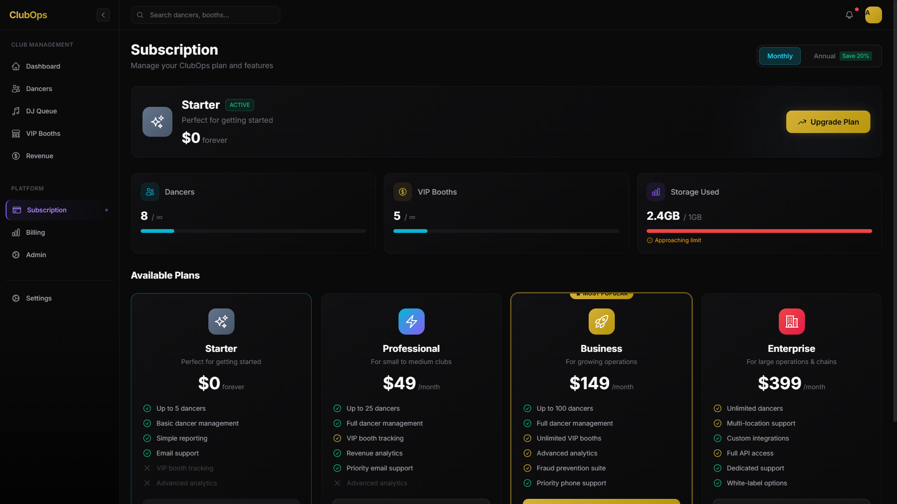
*Flexible pricing tiers with usage tracking and seamless upgrades*

### Current Plan Display

**Plan Card Shows:**
- Plan name (Starter, Professional, Business, Enterprise)
- Status badge (Active, Trial, Expired)
- Monthly/annual pricing
- Billing cycle end date
- **Upgrade** button (if not on Enterprise)

### Usage Metrics

**Three Key Metrics:**

1. **Dancers Used**
   - Current: X dancers in system
   - Limit: Y dancers (per plan)
   - Progress bar (green < 70%, yellow 70-90%, red > 90%)

2. **VIP Booths Used**
   - Current: X active booths
   - Limit: Y booths (per plan)
   - Progress bar with same color coding

3. **Storage Used**
   - Current: X.X GB
   - Limit: Y GB (per plan)
   - Progress bar for file uploads (photos, docs)

**Usage Warnings:**
- **80% Capacity:** Yellow warning badge
- **90% Capacity:** Orange alert badge
- **100% Capacity:** Red block (upgrade required)

### Available Plans

#### Plan Comparison Table

| Feature | Starter | Professional | Business | Enterprise |
|---------|---------|--------------|----------|------------|
| **Price (Monthly)** | $0 forever | $49/month | $149/month | $399/month |
| **Price (Annual)** | - | $39/month* | $119/month* | $319/month* |
| **Max Dancers** | 5 | 25 | 100 | Unlimited |
| **VIP Booths** | 0 | 5 | Unlimited | Unlimited |
| **Storage** | 1 GB | 10 GB | 100 GB | 1 TB |
| **Monthly Reports** | 1 | 10 | Unlimited | Unlimited |
| **Support** | Email | Priority Email | Phone + Email | Dedicated Manager |
| **Fraud Prevention** | ✗ | ✗ | ✓ | ✓ |
| **API Access** | ✗ | ✗ | ✗ | ✓ |
| **Multi-Location** | ✗ | ✗ | ✗ | ✓ |
| **Custom Integrations** | ✗ | ✗ | ✗ | ✓ |
| **White-Label** | ✗ | ✗ | ✗ | ✓ |

*Annual pricing saves 20%

#### Plan Highlights

**Starter (Free Forever):**
- Perfect for new clubs or testing
- Up to 5 dancers
- Basic dancer management
- Simple reporting
- Email support

**Professional ($49/mo):**
- Small to medium clubs
- Up to 25 dancers
- VIP booth tracking (5 booths)
- Revenue analytics
- Priority email support

**Business ($149/mo):** ⭐ **MOST POPULAR**
- Growing operations
- Up to 100 dancers
- Unlimited VIP booths
- **Advanced analytics**
- **Fraud prevention suite**
- Priority phone support
- Custom reports

**Enterprise ($399/mo):**
- Large operations & chains
- **Unlimited everything**
- Multi-location support
- **Full API access**
- Custom integrations
- Dedicated support manager
- White-label options
- SLA guarantee

### Upgrading Your Plan

**Upgrade Process:**

1. Click **"Upgrade Plan"** button on current plan card
2. OR click **"Upgrade to [Plan]"** on any plan card
3. Upgrade modal appears showing:
   - New plan name & features
   - Price (monthly or annual based on toggle)
   - Prorated credit (if mid-cycle)
   - New billing date
4. Review highlighted features
5. Click **"Confirm Upgrade"**
6. Enter payment information (if first time)
7. Upgrade processes immediately
8. Confirmation email sent

**Prorated Billing:**
- Charged only for remaining days in current cycle
- Example: Upgrade on day 15 of 30-day cycle
  - Credit: 15 days of old plan
  - Charge: 15 days of new plan difference

**Billing Cycle Toggle:**
- Switch between Monthly and Annual
- Annual saves 20% (~2 months free)
- Toggle at top of subscription page
- Prices update dynamically

### Managing Payment Methods

**Saved Payment Methods:**
- Credit/Debit cards (Visa, MC, Amex, Discover)
- Last 4 digits displayed
- Expiration date shown
- **Default** badge on primary card

**Adding a Payment Method:**
1. Go to **Billing** → **Payment Methods**
2. Click **"+ Add Card"**
3. Enter card details (Stripe secure form)
4. Set as default (optional)
5. Click **"Add Card"**

**Updating Billing Information:**
- Click **"Edit"** on existing card
- Update name, address, or expiration
- Cannot edit card number (add new card instead)
- Click **"Save Changes"**

### Billing History

**Invoice Table:**
- Date
- Amount
- Plan
- Status (Paid, Pending, Failed)
- **Download PDF** button

**Transaction Details:**
- Each invoice expands to show:
  - Line items
  - Tax breakdown
  - Total paid
  - Payment method used

---

# Part 5: Mobile Access

## Chapter 9: Mobile Responsive Design

ClubOps is **fully optimized for mobile devices**, allowing you to manage your club from anywhere.

### Mobile Login

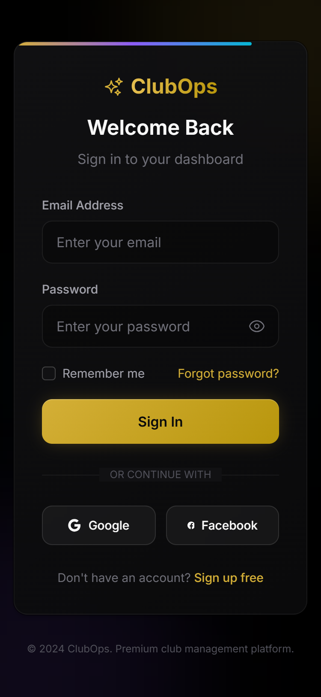
*Touch-optimized login with clean, spacious design*

**Mobile Login Features:**
- Large, easy-to-tap input fields
- Password visibility toggle
- "Remember me" checkbox
- Forgot password link
- Social login buttons

**Best Practices:**
- Use landscape mode for better visibility
- Save credentials in phone's password manager
- Enable biometric login (Face ID, Touch ID) if supported

### Mobile Dashboard

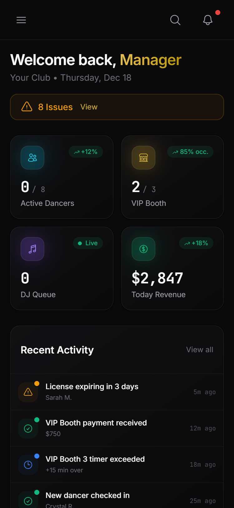
*Key metrics accessible on-the-go with hamburger navigation*

**Mobile Dashboard Layout:**

**Top Bar:**
- ☰ Hamburger menu (opens sidebar)
- ClubOps logo
- Notification bell
- Profile icon

**Metrics Cards:**
- Stack vertically (one per row)
- Swipe left/right to scroll
- Tap to expand for details

**Activity Feed:**
- Infinite scroll
- Pull down to refresh
- Tap any item for full details

**Quick Actions:**
- Floating action button (+ icon, bottom right)
- Quick access to:
  - Check in dancer
  - View queue
  - End VIP session

### Mobile Dancer Management

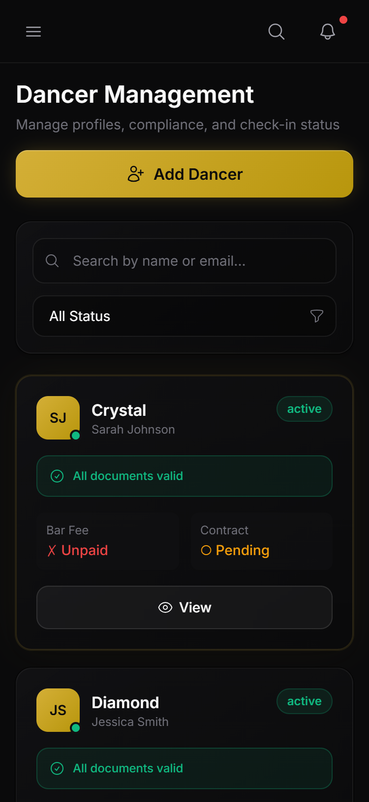
*Swipe-friendly dancer cards with status badges*

**Mobile Dancer Features:**

**Search Bar:**
- Fixed at top (stays visible while scrolling)
- Autocomplete suggestions
- Clear button

**Dancer Cards:**
- Full-width cards
- Swipe left for actions:
  - ✏️ Edit
  - 👁️ View Details
  - ✉️ Send Message
- Swipe right to check in/out
- Tap to expand full profile

**Filter Menu:**
- Tap filter icon (top right)
- Slide-out panel with options
- Apply button updates results instantly

### Mobile VIP Booth View


*Monitor booth status and sessions from anywhere*

**Mobile VIP Features:**

**Booth Grid:**
- 2 columns on phones
- 3 columns on tablets (landscape)
- Color-coded status (green/red)
- Tap booth to expand

**Session Details (Modal):**
- Dancer name & photo
- Countdown timer (large, easy to read)
- Revenue counter
- **Extend** button (full width)
- **End Session** button (full width, red)

**Timer Notifications:**
- Browser notification when 5 min remaining
- Requires notification permission (prompt on first use)
- Vibration alert (if device supports)

### Mobile Navigation

**Hamburger Menu (☰):**
```
📱 MENU
├── Dashboard
├── Dancers
├── DJ Queue
├── VIP Booths
├── Revenue
├── ─────────────
├── Subscription
├── Settings
└── Logout
```

**Gestures:**
- **Swipe right** from left edge: Open menu
- **Swipe left** from right edge: Close menu
- **Tap outside menu:** Close menu
- **Pull down:** Refresh current page

### Mobile Best Practices

**For Owners/Managers:**
- Check dashboard 2-3 times per shift
- Review compliance alerts in morning
- Use mobile for quick check-ins
- Generate reports on desktop (better for analysis)

**For DJs:**
- Desktop mode recommended for queue management
- Mobile for monitoring timers
- Use landscape mode for better view

**For Door Staff:**
- Mobile perfect for check-in/check-out
- Keep phone charged (use power bank)
- Connect to Wi-Fi for faster performance

**Battery Optimization:**
- Lower screen brightness in dark club
- Close unused background apps
- Enable battery saver mode if needed
- Carry portable charger for long shifts

---

# Part 6: Troubleshooting

## Chapter 10: Common Issues & Solutions

### Login & Authentication

#### "I can't log in"

**Troubleshooting Steps:**

1. **Verify Credentials**
   - Check email address (no typos)
   - Ensure CAPS LOCK is off
   - Try copying password from password manager

2. **Reset Password**
   - Click "Forgot Password?" link
   - Check email (including spam folder)
   - Follow reset link (expires in 1 hour)
   - Create new password

3. **Clear Browser Cache**
   - Chrome: Settings → Privacy → Clear browsing data
   - Firefox: Options → Privacy → Clear Data
   - Safari: Preferences → Privacy → Remove All Website Data

4. **Try Different Browser**
   - If issue persists, try Chrome or Firefox
   - Disable browser extensions (especially ad blockers)

5. **Check 2FA**
   - If 2FA enabled, ensure code is current
   - Use backup codes if phone unavailable
   - Contact support to disable 2FA if locked out

#### "Session expired" message

**Cause:** Security timeout after 24 hours of inactivity

**Solution:**
- Click "Login Again" button
- Re-enter credentials
- Session resumes where you left off

**Prevention:**
- Enable "Remember Me" on login
- Keep browser tab open during shift
- Activity resets timer (any click/action)

### Dancer Management

#### "Dancer can't check in"

**Check These:**

1. **License Status**
   - Is license expired? (Red alert)
   - Update license if renewed
   - Cannot override expired license (compliance rule)

2. **Dancer in System**
   - Search in Dancers list
   - Check spelling of name
   - Look under Legal Name vs. Stage Name

3. **Application Status**
   - Was application approved?
   - Check "Pending Applications" tab
   - Approve if ready, deny if not

4. **Account Status**
   - Is dancer marked inactive?
   - Reactivate in dancer profile
   - Check for suspension notes

#### "Can't add new dancer"

**Possible Issues:**

1. **Plan Limit Reached**
   - Check Subscription page for dancer limit
   - See current usage (e.g., 25/25 on Professional plan)
   - **Solution:** Upgrade plan or remove inactive dancers

2. **Duplicate Email**
   - Email already exists in system
   - Search for existing dancer
   - Use different email or update existing record

3. **Required Fields Missing**
   - Legal name is required
   - Email or phone (at least one required)
   - Fill all red-asterisk fields

### DJ Queue

#### "Queue not updating on all screens"

**Cause:** WebSocket connection interrupted

**Solutions:**

1. **Refresh Page**
   - Press F5 or Ctrl+R (Windows)
   - Press Cmd+R (Mac)
   - Changes sync immediately after refresh

2. **Check Internet Connection**
   - Verify Wi-Fi connected
   - Run speed test (should be 5+ Mbps)
   - Restart router if slow

3. **Check Browser Console**
   - Press F12 → Console tab
   - Look for WebSocket errors
   - Screenshot and send to support if errors found

4. **Offline Mode**
   - Yellow "Offline" banner indicates no connection
   - Changes save locally
   - Auto-sync when connection restored

#### "Drag-and-drop not working"

**Try These:**

1. **Browser Compatibility**
   - Update browser to latest version
   - Chrome 90+ recommended
   - Disable conflicting extensions

2. **Touch Devices**
   - Press and hold for 1 second before dragging
   - Use stylus for precision
   - Enable "Touch Mode" in settings

3. **Alternative Method**
   - Use **"+"** button to add dancers
   - Use up/down arrow buttons to reorder
   - Works identically to drag-and-drop

### VIP Booths

#### "Timer not counting down"

**Check:**

1. **Session Actually Started**
   - Booth should show "Occupied" status
   - Timer should display HH:MM:SS
   - If shows "Available", session didn't start

2. **Refresh Page**
   - F5 or Ctrl+R
   - Timer syncs with server time

3. **Browser Tab Active**
   - Browsers throttle inactive tabs
   - Keep ClubOps tab in foreground
   - Or use dedicated monitor

#### "Can't end VIP session"

**Solutions:**

1. **Verify You Have Permission**
   - Owners/Managers can end any session
   - VIP Hosts can only end their own sessions
   - DJs can view only (no end button)

2. **Complete Required Fields**
   - Payment method must be selected
   - Total amount must be confirmed
   - Notes (if required by your settings)

3. **Check Network**
   - Session end requires server confirmation
   - Retry if "Network Error" appears
   - Changes save when connection restored

### Revenue & Reports

#### "Revenue numbers don't match"

**Verify:**

1. **Date Range**
   - Check report start/end dates
   - "Today" = current calendar day (midnight to midnight)
   - Time zone: Reports use club's local time

2. **Pending Transactions**
   - Deferred payments show separately
   - Check "Outstanding" vs. "Collected"
   - Filter table by status

3. **Session Status**
   - VIP sessions must be ended to count
   - Active sessions show as "Pending"
   - End all sessions before running end-of-day report

4. **Browser Cache**
   - Hard refresh: Ctrl+Shift+R
   - Clears cached numbers
   - Fetches latest from server

#### "Can't export report"

**Try:**

1. **Pop-up Blocker**
   - Allow pop-ups for ClubOps domain
   - Chrome: Click address bar icon → Always allow
   - Check browser notification area

2. **File Download Permissions**
   - Check browser download settings
   - Ensure download folder has write permissions
   - Try different download location

3. **PDF vs. Excel**
   - If one format fails, try the other
   - Excel requires Microsoft Excel or compatible app
   - PDF works universally

### Performance Issues

#### "App is slow or laggy"

**Optimizations:**

1. **Close Unused Tabs**
   - Each tab uses memory
   - ClubOps performs best as only active tab
   - Aim for < 10 total browser tabs

2. **Clear Cache & Cookies**
   - Browsers accumulate cached data
   - Clear monthly for best performance
   - Note: May need to re-login

3. **Disable Unused Features**
   - Settings → Notifications → Disable non-critical alerts
   - Reduces background activity
   - Improves responsiveness

4. **Hardware Check**
   - Close other applications
   - Check RAM usage (Task Manager / Activity Monitor)
   - Restart computer if used for multiple days

5. **Network Speed**
   - Run speed test: speedtest.net
   - Need 5+ Mbps for smooth operation
   - 10+ Mbps recommended for real-time features

#### "Images/photos not loading"

**Solutions:**

1. **Check Internet**
   - Photos load from cloud storage
   - Requires stable connection
   - May load slowly on < 3 Mbps

2. **Browser Cache Full**
   - Clear cache (see above)
   - Restart browser
   - Re-login to ClubOps

3. **Ad Blocker Interference**
   - Disable ad blocker for ClubOps
   - Add to whitelist/allowlist
   - Some blockers interfere with image CDN

---

# Appendix: Quick Reference

## Keyboard Shortcuts

| Action | Windows/Linux | Mac |
|--------|---------------|-----|
| **Refresh page** | F5 or Ctrl+R | Cmd+R |
| **Hard refresh** | Ctrl+Shift+R | Cmd+Shift+R |
| **Search dancers** | Ctrl+K | Cmd+K |
| **Open menu** | Alt+M | Opt+M |
| **Go to dashboard** | Alt+H | Opt+H |
| **Logout** | Alt+L | Opt+L |

## Common Tasks Reference

| Task | Quick Path |
|------|-----------|
| **Check in dancer** | Dashboard → Search → Check In |
| **View license alerts** | Dashboard → License Alerts panel |
| **Add to DJ queue** | DJ Queue → Drag dancer to queue |
| **Start VIP session** | VIP Booths → Click booth → Start |
| **Run revenue report** | Revenue → Reports → Generate |
| **Add team member** | Settings → Team → Add Member |
| **Upgrade plan** | Subscription → Upgrade button |
| **Export data** | Any table → Export button (top right) |

## Status Icon Legend

| Icon | Meaning |
|------|---------|
| ✓ **Green Check** | Compliant, Paid, Valid |
| ⚠ **Yellow Warning** | Expiring soon, Action needed |
| ✗ **Red X** | Expired, Unpaid, Error |
| ○ **Gray Circle** | Pending, Not applicable |
| 🔵 **Blue Dot** | Active, In progress |
| 🟢 **Green Badge** | Available, Good status |
| 🔴 **Red Badge** | Occupied, Critical |

## Support Contact

**Email:** support@clubops.com
**Hours:** Monday-Friday, 9AM-6PM PT
**Emergency:** 24/7 via email (4-hour response)

**When Contacting Support, Include:**
1. Club name
2. Your email address
3. Description of issue
4. Screenshots (if applicable)
5. Browser & device info
6. Steps to reproduce problem

---

## Document Information

| Field | Value |
|-------|-------|
| **Document Version** | 2.0 (With Screenshots) |
| **Application Version** | 3.0.5 |
| **Created** | December 18, 2025 |
| **Last Updated** | December 18, 2025 |
| **Target Audience** | Club Owners, Managers, Staff |
| **Status** | Complete ✅ |

---

*Thank you for choosing ClubOps. We're committed to making your club operations smoother, simpler, and more profitable.*

**🎉 You're now ready to maximize your ClubOps experience!**
