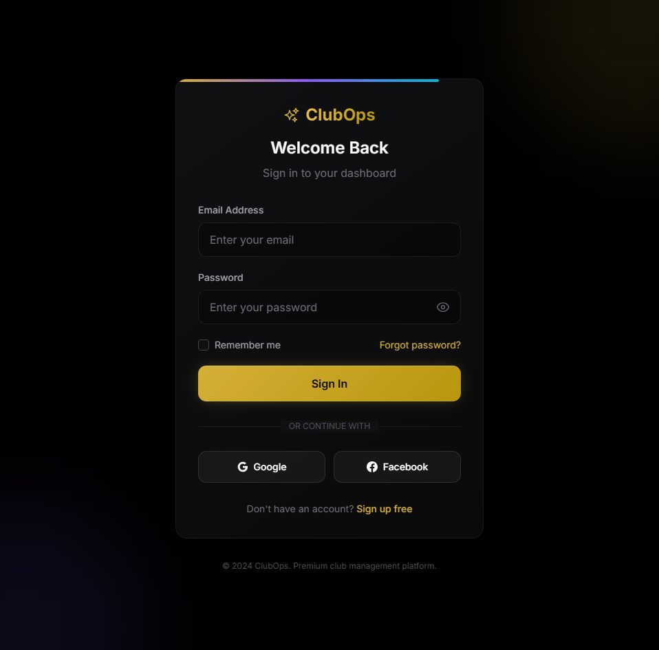
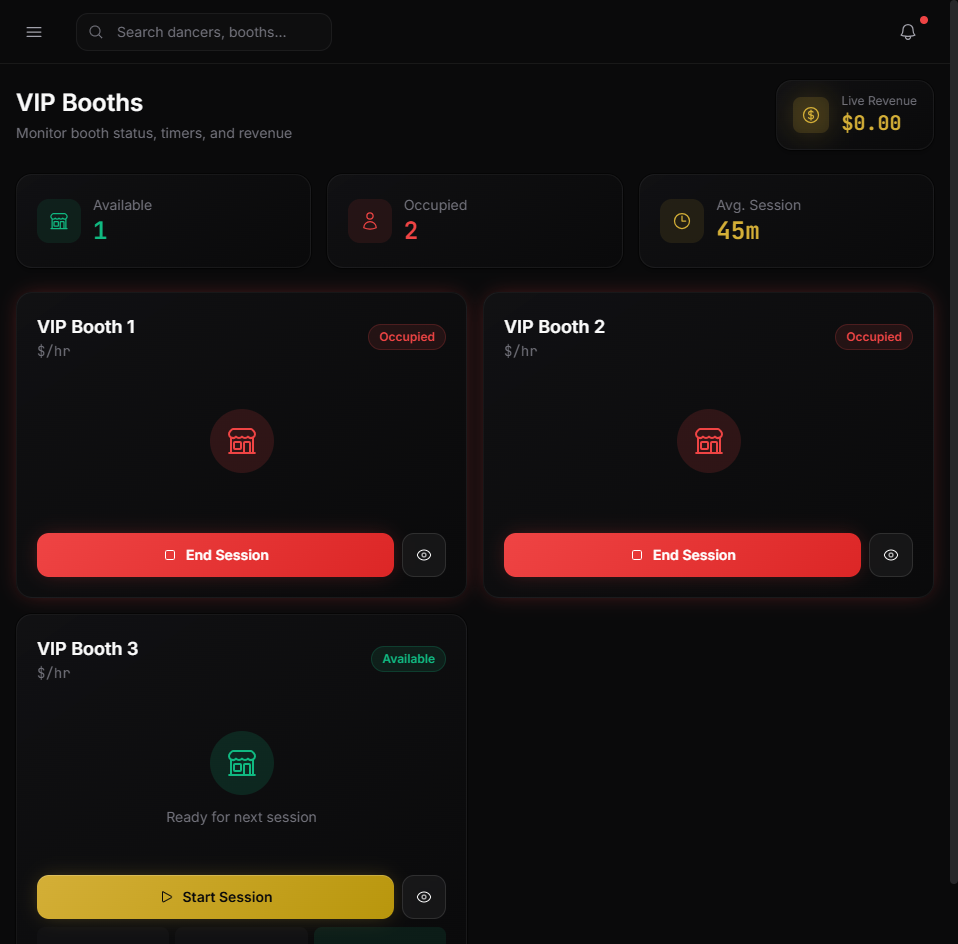
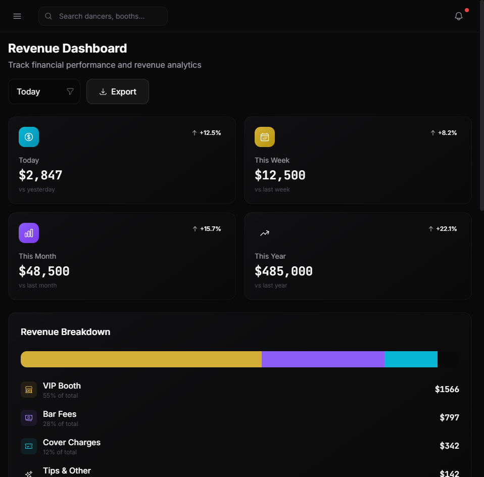
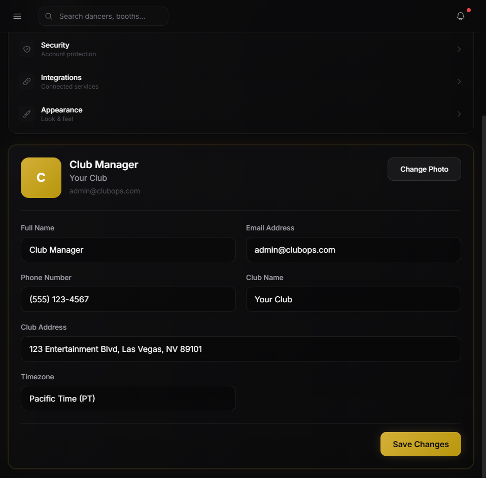
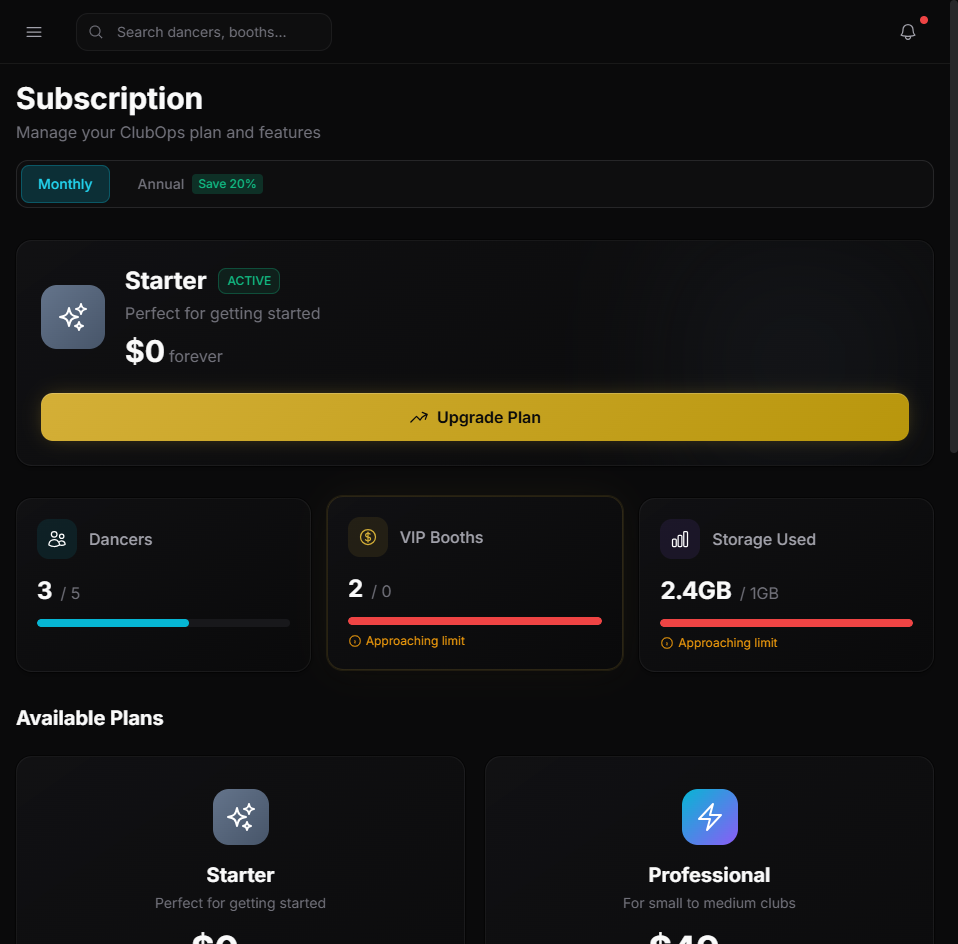
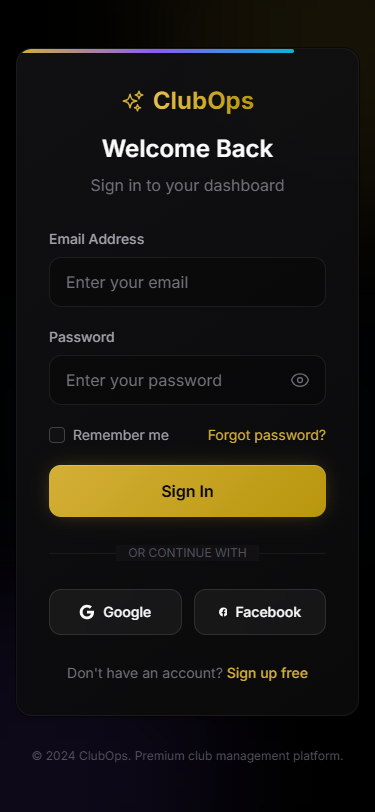

# ClubOps - UI/UX Documentation

**Version:** 2.0  
**Date:** December 14, 2025  
**Status:** Production Ready  
**API Version:** v3.0.5  
**Live URL:** https://clubops-saas-frontend.vercel.app

---

## Executive Summary

ClubOps is a comprehensive SaaS platform designed for gentlemen's club management. The application features a premium dark theme optimized for low-light environments, with accent colors of metallic gold, deep teal, and subtle red highlights. Built with modern web technologies and deployed on enterprise-grade infrastructure, ClubOps delivers real-time operational insights and compliance management for club operators.

### Key Design Principles
- **Dark Theme**: Optimized for club environments with minimal eye strain
- **Color Palette**: Deep charcoal backgrounds (#0D0D0D), metallic gold accents (#D4AF37), teal highlights (#0D9488)
- **Typography**: Clean Inter typeface with high contrast for readability
- **Data Visualization**: Real-time metrics with color-coded status indicators
- **Mobile-First**: Fully responsive design works seamlessly on all devices

---

## Application Screenshots

### 0. Authentication (Login)
**File:** `screenshots/00-login.png`

*Premium login experience with social authentication options*

Secure authentication portal for club staff and management:

**Login Form:**
- Email address field with validation
- Password with visibility toggle
- "Remember me" checkbox for session persistence
- Forgot password recovery link

**Social Login Options:**
- Google OAuth integration
- Facebook OAuth integration

**Design Elements:**
- ClubOps branding with sparkle icon
- Gradient accent bar for premium feel
- Gold "Sign In" button
- Dark theme optimized for club environments

---

### 1. Dashboard (Home)
**File:** `screenshots/01-dashboard.png`

*Dashboard showing real-time metrics, activity feed, and quick actions*

The main dashboard provides an at-a-glance view of club operations:

**Key Metrics Cards:**
- Active Dancers: Real-time count with gold badge
- Tonight's Revenue: Live total with percentage change indicator
- VIP Booths Active: Utilization tracking (e.g., 3/8)
- Queue Length: Real-time dancer queue count

**Features:**
- Quick action buttons for common tasks
- Staff status indicators
- Revenue trend visualization
- Live activity feed with timestamps

---

### 2. Dancer Management
**File:** `screenshots/02-dancers.png`

*Comprehensive dancer roster with compliance tracking and status badges*

Comprehensive dancer roster management with compliance tracking:

**License Status Color Coding:**
- 🟢 **Green (Valid)**: License current and valid
- 🟡 **Yellow (Expiring Soon)**: License expires within 14 days
- 🔴 **Red (Expired)**: Immediate action required

**Dancer Cards Display:**
- Profile photo placeholder
- Stage name prominently displayed
- License expiration date
- Current status (Checked In/Available/On Break)
- Quick action buttons

**Compliance Features:**
- Proactive expiration alerts
- Blocking alerts for expired licenses
- Filter by status (All/Active/Pending/Expired)
- Batch operations for roster management

---

### 3. DJ Queue Management
**File:** `screenshots/03-dj-queue.png`

*Real-time queue management with drag-and-drop reordering*

The core operational interface for DJ workflow:

**Stage Queue Section:**
- Drag-and-drop dancer reordering
- Visual queue with numbered positions
- Stage assignment (Main Stage, VIP Stage, etc.)
- Estimated wait times

**Now Playing Display:**
- Current performer highlighted
- Active stage timer
- Song information
- Quick controls

**Music Player Integration:**
- Built-in audio player
- Format support: MP3, AAC, FLAC, WAV
- Dancer-specific playlists
- Volume and playback controls

---

### 4. VIP Booth Management
**File:** `screenshots/04-vip-booths.png`

*Real-time booth tracking with session timers and status indicators*

Real-time VIP booth tracking and session management:

**Booth Status Grid:**
- **Available** (Green): Ready for booking
- **Occupied** (Gold/Yellow): Active session with timer
- **Reserved** (Blue): Pre-booked for upcoming
- **Cleaning** (Gray): Maintenance/turnover

**Session Information:**
- Active dancer assignment
- Session start time
- Running timer display
- Revenue tracking per booth

**Booth Details:**
- Booth number/name
- Capacity information
- Amenity icons
- Quick status toggle

---

### 5. Revenue Dashboard
**File:** `screenshots/05-revenue.png`

*Financial tracking with period comparisons and category breakdown*

Financial tracking and reporting interface:

**Summary Cards:**
| Period | Revenue | Change |
|--------|---------|--------|
| Today | $2,847 | +12.5% |
| This Week | $12,500 | +8.2% |
| This Month | $48,500 | +15.7% |
| This Year | $485,000 | +22.1% |

**Revenue Breakdown Bar Chart:**
- VIP Booth Revenue: 55% (Gold)
- Bar Fees: 28% (Purple)
- Cover Charges: 12% (Teal)
- Tips & Other: 5% (Gray)

**Features:**
- Time period filters
- Export functionality (CSV, PDF)
- Trend analysis
- Category breakdown visualization

---

### 6. Settings
**File:** `screenshots/06-settings.png`

*Account and system configuration with tabbed navigation*

Account and system configuration:

**Settings Tabs:**
1. **Profile** - Personal & club information
2. **Notifications** - Alert preferences
3. **Preferences** - System settings
4. **Security** - Account protection
5. **Integrations** - Connected services
6. **Appearance** - Look & feel customization

**Profile Section:**
- Avatar with "Change Photo" option
- Full Name input
- Email Address
- Phone Number
- Club Name
- Club Address
- Timezone selector

**Design Notes:**
- Tab navigation with gold highlight on active tab
- Form fields with dark input backgrounds
- Gold "Save Changes" button
- Responsive layout for all screen sizes

---

### 7. Subscription Management
**File:** `screenshots/07-subscription.png`

*Tiered pricing with usage metrics and upgrade options*

Manage your ClubOps subscription and monitor usage:

**Current Plan Display:**
- Active plan with status badge
- Usage metrics (dancers, booths, storage)
- Progress bars showing limit utilization

**Available Tiers:**
| Plan | Price | Dancers | VIP Booths | Storage |
|------|-------|---------|------------|---------|
| Starter | $0/forever | 5 | 0 | 1GB |
| Professional | $49/month | 25 | 5 | 10GB |
| Business | $149/month | 100 | Unlimited | 50GB |
| Enterprise | $399/month | Unlimited | Unlimited | Unlimited |

**Features:**
- Monthly/Annual toggle (20% savings on annual)
- Usage limit warnings with progress indicators
- One-click upgrade buttons
- "Most Popular" badge on Business tier
- Clear feature comparison

---

## Mobile Responsive Design

ClubOps is fully optimized for mobile devices, allowing managers to monitor operations from anywhere. The interface adapts intelligently with hamburger navigation, stacked cards, and touch-optimized controls.

### Mobile Login

*Clean, touch-optimized login experience*

Responsive login form adapts to screen width with full functionality:
- Touch-friendly input fields
- Social login buttons optimized for mobile
- Readable typography at all sizes

