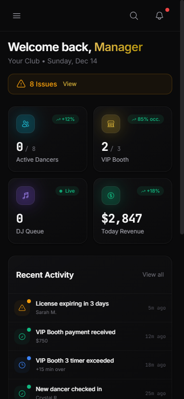
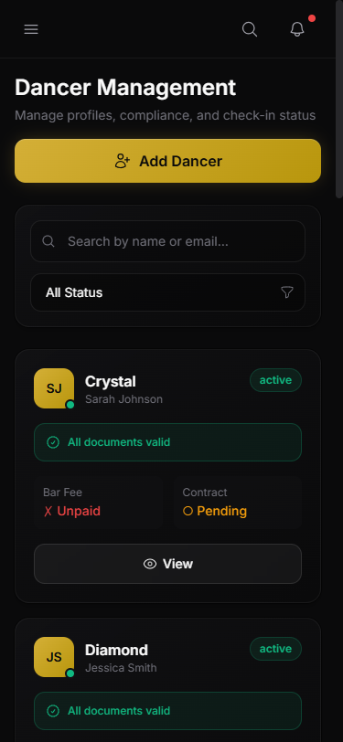
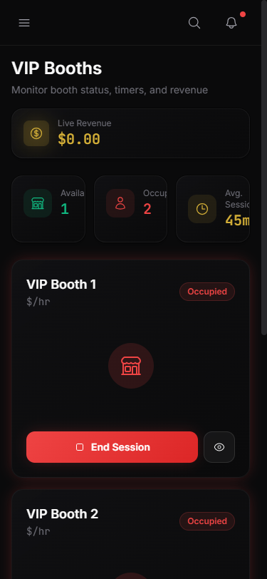

# 📋 ClubOps Manual Update Prompt

## TASK: Update ClubOps UI Documentation

You are updating the ClubOps Operations Manual to reflect the current state of the application. This is an investor-ready document that needs to be polished and professional.

---

## FILES TO WORK WITH

### Input Files:
1. **Main Documentation:** `C:\Users\tonyt\ClubOps-SaaS\documentation\ClubOps-UI-Documentation.md`
2. **PRD Reference:** `C:\Users\tonyt\ClubOps-SaaS\GentlementClub_Manager_App-PRD.txt` (in project files)
3. **App Prompt:** `C:\Users\tonyt\ClubOps-SaaS\GentlementClub_Manager_App-Prompt.txt` (in project files)

### Screenshot Assets Available:

**Desktop Screenshots (8 files):**
```
screenshots/00-login.png         - Login/authentication page
screenshots/01-dashboard.png     - Main dashboard with metrics
screenshots/02-dancers.png       - Dancer management roster
screenshots/03-dj-queue.png      - DJ queue interface
screenshots/04-vip-booths.png    - VIP booth management
screenshots/05-revenue.png       - Revenue/financial tracking
screenshots/06-settings.png      - Settings/preferences page
screenshots/07-subscription.png  - Subscription tiers & billing
```

**Mobile Screenshots (4 files):**
```
screenshots/mobile/mobile-00-login.png      - Mobile login view
screenshots/mobile/mobile-01-dashboard.png  - Mobile dashboard
screenshots/mobile/mobile-02-dancers.png    - Mobile dancer list
screenshots/mobile/mobile-03-vip.png        - Mobile VIP booths
```

---

## REQUIRED UPDATES

### 1. 🔄 Terminology Changes (CRITICAL)

**Replace ALL instances:**
| Old Term | New Term |
|----------|----------|
| VIP Room | VIP Booth |
| VIP Rooms | VIP Booths |
| room | booth (when referring to VIP areas) |

**Example changes:**
- "VIP Room Management" → "VIP Booth Management"
- "VIP Rooms Active: 3/8" → "VIP Booths Active: 3/8"
- "room tracking" → "booth tracking"

### 2. 📸 Add Inline Screenshots

Insert screenshots using markdown syntax at appropriate locations:

```markdown

```

**Placement Guidelines:**
- Add screenshot AFTER the section heading
- Add brief caption below each screenshot
- Use relative paths from documentation folder

**Example format:**
```markdown
### 1. Dashboard (Home)


*Dashboard showing real-time metrics, activity feed, and quick actions*

The main dashboard provides an at-a-glance view...
```

### 3. 📱 Add Mobile Responsive Section

Add a new section showcasing mobile views:

```markdown
## Mobile Responsive Design

ClubOps is fully optimized for mobile devices, allowing managers to monitor operations from anywhere.

### Mobile Login

*Clean, touch-optimized login experience*

### Mobile Dashboard

*Key metrics accessible on-the-go with hamburger navigation*

### Mobile Dancer Management

*Swipe-friendly dancer cards with status badges*

### Mobile VIP Booth View

*Monitor booth status and sessions from anywhere*
```

### 4. 🆕 Add Subscription Section

Add new section for the Subscription page:

```markdown
### 7. Subscription Management
**File:** `screenshots/07-subscription.png`


*Tiered pricing with usage metrics and upgrade options*

Manage your ClubOps subscription and monitor usage:

**Current Plan Display:**
- Active plan with status badge
- Usage metrics (dancers, booths, storage)
- Progress bars showing limit utilization

**Available Tiers:**
| Plan | Price | Dancers | VIP Booths | Storage |
|------|-------|---------|------------|---------|
| Starter | $0/forever | 5 | 0 | 1GB |
| Professional | $49/month | 25 | 5 | 10GB |
| Business | $149/month | 100 | Unlimited | 50GB |
| Enterprise | $399/month | Unlimited | Unlimited | Unlimited |

**Features:**
- Monthly/Annual toggle (20% savings)
- Usage limit warnings
- One-click upgrade buttons
- "Most Popular" badge on Business tier
```

### 5. 🔐 Add Login Section

Add section for the Login page:

```markdown
### 0. Authentication (Login)
**File:** `screenshots/00-login.png`


*Premium login experience with social authentication options*

Secure authentication portal:

**Login Form:**
- Email address field
- Password with visibility toggle
- "Remember me" checkbox
- Forgot password link

**Social Login Options:**
- Google OAuth
- Facebook OAuth

**Design Elements:**
- ClubOps branding with sparkle icon
- Gradient accent bar
- Gold "Sign In" button
- Dark theme optimized for club environments
```

### 6. 📊 Update Metrics to Match Screenshots

Review each screenshot and update the documented metrics to match what's actually shown:
- Dashboard revenue figures
- Dancer counts
- VIP booth occupancy numbers
- Any other dynamic data

### 7. 🎨 Update Color Palette

Ensure the color palette section reflects the actual colors used:
- Gold accent: #D4AF37
- Teal/Cyan highlights
- Red for occupied/error states
- Green for available/success states

### 8. 📝 Update Navigation Structure

Update to match current sidebar:
```
ClubOps
├── Club Management
│   ├── Dashboard
│   ├── Dancers
│   ├── DJ Queue
│   ├── VIP Booths
│   └── Revenue
├── Platform
│   ├── Subscription
│   ├── Billing
│   └── Admin
└── Settings
```

### 9. ✅ Verify Technical Details

Update if needed:
- Backend URL: https://clubops-backend.vercel.app
- Frontend URL: https://clubops-saas-frontend.vercel.app
- API version: v3.0.5
- Test credentials: admin@clubops.com / password

---

## OUTPUT FORMAT

Create an updated `ClubOps-UI-Documentation.md` with:

1. **Executive Summary** - Updated overview
2. **Authentication** - Login section with screenshot
3. **Application Screenshots** - All 8 desktop screens with inline images
4. **Mobile Responsive Design** - All 4 mobile screenshots
5. **Subscription Plans** - Pricing tier details
6. **Color Palette** - Updated hex codes
7. **Typography** - Font specifications
8. **Navigation Structure** - Current sidebar layout
9. **Technical Stack** - Technologies used
10. **Production URLs** - Live links

---

## QUALITY CHECKLIST

Before completing, verify:

- [ ] All "VIP Room" changed to "VIP Booth"
- [ ] All 8 desktop screenshots embedded
- [ ] All 4 mobile screenshots embedded
- [ ] Login section added
- [ ] Subscription section added
- [ ] Navigation structure updated
- [ ] Technical URLs are correct
- [ ] Document is professionally formatted
- [ ] No broken image paths
- [ ] Metrics match screenshot content

---

## EXECUTION COMMAND

```
Read the existing documentation, apply all updates listed above, and write the complete updated file to:
C:\Users\tonyt\ClubOps-SaaS\documentation\ClubOps-UI-Documentation.md
```

---

*Prompt Created: December 14, 2025*
